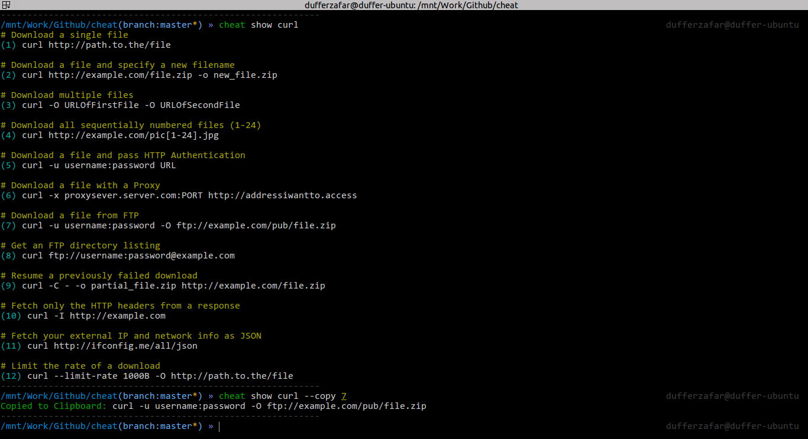

# cheat

Reimplementation of [Chris Lane's cheatsheet](https://github.com/chrisallenlane/cheat) script in [Go](http://golang.org/). 

I'm mostly doing this as a means of learning Go as it seemed like a nice first project to start with. 

# Setup

Install: `go get github.com/dufferzafar/cheat`

Fetch cheatsheets: `cheat fetch`

Test: `cheat show git`

# Usage

`~/.cheatrc` - A JSON based config file which stores basic configuration.

`cheat show git` - Show the git cheatsheet

`cheat edit git` - Edit the git sheet. A new one will be created if it doesn't already exist.

`cheat show git --copy 12` - Copy the 12th cheat from the sheet

`cheat fetch` - When you feel like updating the sheets.

# Todo

* Autocomplete commands and available cheats for bash and zsh

* Allow multiple cheat directories
* `cheat fetch` command to fetch all the cheatsheets from a repo.

* Or execute a command by, `cheat git 12` ?
* Colors on the AppHelpTemplate.
* User's favorite editor, with support for command line parameters.

* Wrap the output to a fit width? like 79 characters?

* Update cheat sheets from chris' repo, `cheat --update` for updating it the safe way, and `cheat --update --force` for overwriting all the cheats with the downloaded version.

* Should grep support be added? or can that be achived by `grep`ping things?

# Places that have sheets

* [Chris' Repo](https://github.com/chrisallenlane/cheat/tree/master/cheat/cheatsheets)
* [Command Line Fu](http://www.commandlinefu.com/site/api)
* [bro pages](http://bropages.org/browse)
* [Markdown Cheatsheets](https://github.com/rstacruz/cheatsheets)
* [Kapeli's Sheets](https://github.com/Kapeli/cheatsheets)
* [Git Cheat](https://github.com/0xAX/git-cheat)
* [More Sheets](https://github.com/Dmitrii-I/cheat)

# Prior Art

* [/chrisallenlane/cheat](http://github.com/chrisallenlane/cheat) in Python
* [/jahendrie/cheat](https://github.com/jahendrie/cheat) in Bash
* [/lucaswerkmeister/cheats](https://github.com/lucaswerkmeister/cheats) in Bash
* [/defunkt/cheat](https://github.com/defunkt/) in Ruby
* [/torsten/cheat](https://github.com/torsten/cheat) in Ruby (single file)
* [/arthurnn/cheatly](https://github.com/arthurnn/cheatly) in Ruby

* [Bro Pages](https://github.com/hubsmoke/bro/) 
* [tldr; Pages](https://github.com/tldr-pages/tldr) 
